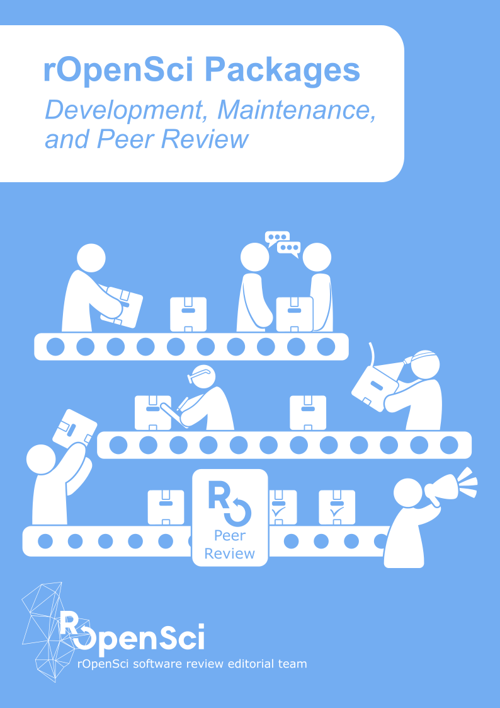

--- 
title: "rOpenSci Packages: Development, Maintenance, and Peer Review"
author: "rOpenSci software review editorial team (current and alumni): Brooke Anderson, Scott Chamberlain, Laura DeCicco, Julia Gustavsen, Anna Krystalli, Mauro Lepore, Lincoln Mullen, Karthik Ram, Noam Ross, Maëlle Salmon, Melina Vidoni"
date: "`r Sys.Date()`"
site: bookdown::bookdown_site
documentclass: book
bibliography: [book.bib]
biblio-style: apalike
link-citations: yes
github-repo: ropensci/dev_guide
twitter-handle: ropensci
url: 'https\://devguide.ropensci.org/'
description: "Extended version of the rOpenSci packaging guide. This book is a guide for authors, maintainers, reviewers and editors of rOpenSci. The first section of the book contains our guidelines for creating and testing R packages. The second section is dedicated to rOpenSci's software peer review process: what it is, our policies, and specific guides for authors, editors and reviewers throughout the process. The third and last section features our best practice for nurturing your package once it has been onboarded: how to collaborate with other developers, how to document releases, how to promote your package and how to leverage GitHub as a development platform. The third section also features a chapter for anyone wishing to start contributing to rOpenSci packages."
cover-image: images/cover.png
apple-touch-icon: "images/apple-touch-icon.png"
apple-touch-icon-size: 120
favicon: "images/favicon.ico"
---


# {-}

```{r, echo = FALSE, fig.cap="cover image", out.width="100%"}

```

<a href="https://doi.org/10.5281/zenodo.2553043"></a>

<a rel="license" href="https://creativecommons.org/licenses/by-nc-sa/3.0/us/"></a><br /> This work is licensed under [a Creative Commons Attribution-NonCommercial-ShareAlike 3.0 United States License](https://creativecommons.org/licenses/by-nc-sa/3.0/us/). Refer to [its Zenodo DOI](https://doi.org/10.5281/zenodo.2553043) to cite it.

```{r zenodo, echo=FALSE, results = 'asis', warning=FALSE}
cat("\n```bibtex\n")
u <- "https://zenodo.org/record/2553043" # universal URL redirects to latest
s <- rvest::session(u)
u <- paste0(s$url, "/export/hx") # redirected
out <- rvest::read_html(u)
bibentry <- rvest::html_text(rvest::html_element(out, "pre"))
writeLines(strsplit(bibentry, "\n")[[1]], "dev_citation_BibTeX.bib")
cat(bibentry)
cat("\n```\n")
```

You can also read the [PDF version](/ropensci-dev-guide.pdf) of this book.

# Preface {-}

Welcome! This book is a guide for authors, maintainers, reviewers and editors of rOpenSci.

The [first section of the book](#building) contains our guidelines for creating and testing R packages. 

The [second section](#softwarereviewintro) is dedicated to rOpenSci's software peer review process: what it is, our policies, and specific guides for authors, editors and reviewers throughout the process. For _statistical software review_, refer to the [project webpage and resources](https://ropensci.org/stat-software-review/).

The [third and last section](#collaboration) features our best practice for nurturing your package once it has been onboarded: how to collaborate with other developers, how to document releases, how to promote your package and how to leverage GitHub as a development platform. The third section also features a [chapter for anyone wishing to start contributing to rOpenSci packages](#contributingguide).

We hope that you'll find the guide useful and clear, and welcome your suggestions in the [issue tracker of the book](https://github.com/ropenscilabs/dev_guide/issues). Happy R packaging!

The rOpenSci editorial team.

This book is a living document. 
You can view updates to our best practices and policies via the [release notes](#booknews).  
You can cite this book using [its Zenodo metadata and DOI](https://doi.org/10.5281/zenodo.2553043).

```{r zenodo2, echo=FALSE, results = 'asis', warning=FALSE}
cat("\n```bibtex\n")
cat(readLines("dev_citation_BibTeX.bib"), sep = "\n")
cat("\n```\n")
done <- file.remove("dev_citation_BibTeX.bib")
```

_If you want to contribute to this book (suggestions, corrections) please refer to [the GitHub repository](https://github.com/ropensci/dev_guide) in particular [the contributing guidelines](https://github.com/ropensci/dev_guide#contributing). Thanks!_

_We are thankful for all authors, reviewers and guest editors for helping us improve the system and this guide over the years. Thanks also to the following persons who made contributions to this guide and its previous incarnations: [Katrin Leinweber](https://github.com/katrinleinweber), [John Baumgartner](https://github.com/johnbaums), [François Michonneau](https://github.com/fmichonneau), [Christophe Dervieux](https://github.com/cderv), [Lorenzo Busetto](https://github.com/lbusett), [Ben Marwick](https://github.com/benmarwick), [Nicholas Horton](https://github.com/nicholasjhorton), [Chris Kennedy](https://github.com/ck37), [Mark Padgham](https://github.com/mpadge), [Jeroen Ooms](https://github.com/jeroen), [Sean Hughes](https://github.com/seaaan), [Jan Gorecki](https://github.com/jangorecki), [Joseph Stachelek](https://github.com/jsta), [Dean Attali](https://github.com/daattali), [Julia Gustavsen](https://github.com/jooolia), [Nicholas Tierney](https://github.com/njtierney), [Rich FitzJohn](https://github.com/richfitz), [Tiffany Timbers](https://github.com/ttimbers), [Hilmar Lapp](https://github.com/hlapp), [Miles McBain](https://github.com/milesmcbain), [Bryce Mecum](https://github.com/amoeba), [Jonathan Carroll](https://github.com/jonocarroll/), [Carl Boettiger](https://github.com/cboettig/), [Florian Privé](https://github.com/privefl), [Stefanie Butland](https://github.com/stefaniebutland), [Daniel Possenriede](https://github.com/dpprdan/), [Hadley Wickham](https://github.com/hadley/), [Hugo Gruson](https://github.com/bisaloo/), [Mauro Lepore](https://github.com/maurolepore/), [Matthew Fidler](https://github.com/mattfidler), [Luke McGuinness](https://github.com/mcguinlu), [Aaron Wolen](https://github.com/aaronwolen), [Indrajeet Patil](https://github.com/IndrajeetPatil), [Kevin Wright](https://github.com/kwstat), [Will Landau](https://github.com/wlandau), [Hugo Gruson](https://github.com/Bisaloo). Please tell us if we forgot to acknowledge your contribution!_

