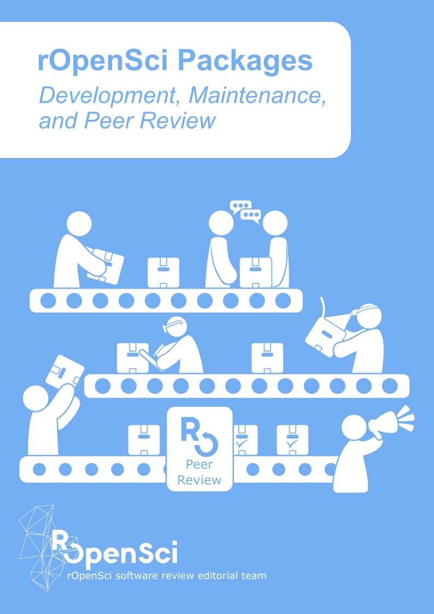

# rOpenSci Packages: Development, Maintenance, and Peer Review

Guide for package authors, maintainers, reviewers and editors in rOpenSci software peer-review system. This book is a guide for authors, maintainers, reviewers and editors of rOpenSci. The first section of the book contains our guidelines for creating and testing R packages. The second section is dedicated to rOpenSci’s software peer review process: what it is, our policies, and specific guides for authors, editors and reviewers throughout the process. The third and last section features our best practice for nurturing your package once it has been onboarded: how to collaborate with other developers, how to document releases, how to promote your package and how to leverage GitHub as a development platform. The third section also features a chapter for anyone wishing to start contributing to rOpenSci packages.

Author

rOpenSci software review editorial team (current and alumni)

# rOpenSci Dev Guide

\
This work is licensed under [a Creative Commons Attribution-NonCommercial-ShareAlike 3.0 United States License](https://creativecommons.org/licenses/by-nc-sa/3.0/us/). Refer to [its Zenodo DOI](https://doi.org/10.5281/zenodo.2553043) to cite it.

    @software{ropensci_2026_18885936,
      author       = {rOpenSci and
                      Anderson, Brooke and
                      Bellini Saibene, Yanina and
                      Butland, Stefanie and
                      Chamberlain, Scott and
                      DeCicco, Laura and
                      Gustavsen, Julia and
                      Krystalli, Anna and
                      LaZerte, Steffi and
                      Lepore, Mauro and
                      Mullen, Lincoln and
                      Padgham, Mark and
                      Ram, Karthik and
                      Ross, Noam and
                      Salmon, Maëlle and
                      Vidoni, Melina and
                      Riederer, Emily and
                      Sparks, Adam and
                      Hollister, Jeff and
                      Toby Hocking and
                      Emi Tanaka and
                      Jouni Helske and
                      Beatriz Milz and
                      Margaret Siple and
                      Nima Hejazi and
                      Andrew Heiss and
                      Lucy D'Agostino McGowan},
      title        = {rOpenSci Packages: Development, Maintenance, and
                       Peer Review
                      },
      month        = mar,
      year         = 2026,
      publisher    = {Zenodo},
      version      = {v1.0.0},
      doi          = {10.5281/zenodo.18885936},
      url          = {https://doi.org/10.5281/zenodo.18885936},
      swhid        = {swh:1:dir:da641d8a96ec67c408ca8049c32e81a8816d25d9
                       ;origin=https://doi.org/10.5281/zenodo.2553043;vis
                       it=swh:1:snp:210372f64a2b66edd08eb533e185d06f61ca7
                       45e;anchor=swh:1:rel:37bb33d3945054af44d4642d68e62
                       90e901b06a8;path=ropensci-dev\_guide-92c7dc7
                      },
    }

You can also read the [PDF version](./ropensci-dev-guide.pdf) of this book.
