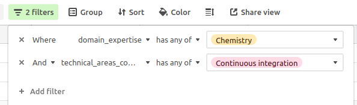

---
aliases:
  - editorguide.html
---

# Guide for Editors {#editorguide}

```{block, type="summaryblock"}
Software Peer Review at rOpenSci is managed by a team of editors.
The Editor-in-Chief (EiC) role is rotated (generally quarterly) amongst experienced members of our editorial board.
Information on current and recent editors and their activities can be viewed on our editorial dashboard at [dashboard.ropensci.org](https://dashboard.ropensci.org).

This chapter presents the responsabilities [of the Editor-in-Chief](#eicchecklist), of [any editor in charge of a submission](#editorchecklist), [how to respond to an out-of-scope submission](#outofscoperesponse) and [how to manage a dev guide release](#bookrelease).

If you're a guest editor, thanks for helping! Please contact the editor who invited you to handle a submission for any question you might have.
```

> Always assume participants in the software review system (fellow editors, submitters, reviewers) are doing their best, and communicate gracefully accordingly, especially when inquiring why a thing is delayed.

## Editors' responsibilities {#editors-responsibilities}

- In addition to handling packages (about 4 a year), editors weigh in on group editorial decisions, such as whether a package is in-scope, and determining updates to our policies. We generally do this through Slack, which we expect editors to be able to check regularly.

- You only need to keep track of your own submissions, but if you do notice an issue with a package that is being handled by another editor, feel free to raise that issue directly with the other editor, or post the concern to editors-only channel on slack. Examples:
  
  - You know of an overlapping package, that hasn't been mentioned in the process yet.
  - You see a question to which you have an expert answer that hasn't been given after a few days (such as linking to a blog post which may answer a question).
  - Concerns related to general review progress, including aspects such as the speed of the process, should be directed to the current Editor-in-Chief.

## Handling Editor's Checklist {#editorchecklist}

### Upon submission: {#upon-submission}

- Submission will automatically generate package check output from ropensci-review-bot. The check results should be examined for any outstanding issues (most exceptions will need to be justified by the author in the particular context of their package). Checks can be re-run after any package change with the comment `@ropensci-review-bot check package`.
- For statistical submissions (identifiable as "Submission Type: Stats" in issue template), add the "stats" label to the issue (if not already added).
- Check that issue template has been properly filled out. Most common oversights and omissions should be caught and noted by the bot, but a manual check always helps. Editors can edit templates directly for minor fixes, or may direct authors to fill any mandatory template fields that may be missing.
- The checking system is rebuilt at every Tuesday at 00:01 UTC, and can take a couple of hours. If automatic checks fail around that time, wait a few hours and try again.
- After automatic checks are posted, use the [editor template](#editortemplate) to guide initial checks and record your response to the submission. You can also streamline your editor checks by using the [`pkgreviewr` package created by  associate editor Anna Krystalli](https://docs.ropensci.org/pkgreviewr/articles/editors.html).  Please strive to finish the checks and start looking for reviewers within 5 working days.
- Check against policies for [fit](#aims-and-scope) and [overlap](#overlap).
  Initiate discussion via Slack #software-review channel if needed for edge cases that haven't been caught by previous checks by the EiC.
  If reject, see [this section](#outofscoperesponse) about how to respond.
- Ensure that the package gets tested on multiple platforms (having the package built on several operating systems via GitHub Actions for instance; see [criteria in this section of the CI chapter](#whichci) for further details and options).
- Wherever possible when asking for changes, direct authors to automatic tools such as [`usethis`](https://usethis.r-lib.org/) and [`styler`](https://styler.r-lib.org/), and to online resources (sections of this guide, sections of the [R packages book](https://r-pkgs.org/)) to make your feedback easier to use. See this [example of editor's checks](https://github.com/ropensci/software-review/issues/207#issuecomment-379909739).
- Ideally, any remarks you make as editor should be addressed before assigning reviewers.
- If initial checks show major gaps, request changes before assigning reviewers. If the author mentions changes might take time, [apply the holding label by calling `@ropensci-review-bot put on hold`](#policiesreviewprocess). You'll get a reminder in the issue every 90 days to check in with the package author(s).
- If the package raises a new issue for rOpenSci policy, start a conversation in Slack or open a discussion on the [rOpenSci forum](https://discuss.ropensci.org/) to discuss it with other editors ([example of policy discussion](https://discuss.ropensci.org/t/overlap-policy-for-package-onboarding/368)).

### Look for and assign two reviewers: {#look-for-and-assign-two-reviewers}

#### Tasks {#tasks}

- Comment with `@ropensci-review-bot seeking reviewers`.
- Use the [email template](#reviewrequesttemplate) if needed for inviting reviewers
  - When inviting reviewers, include something like "if I don't hear from you in a week, I'll assume you are unable to review," so as to give a clear deadline when you'll move on to looking for someone else.
- Assign reviewers with `@ropensci-review-bot assign @username as reviewer`. `add` can also be used instead of `assign`, and `to reviewers` (plural) instead of `as reviewer` (single). The following is thus also valid: `@ropensci-review-bot add @username to reviewers`. One command should be issued for each reviewer. If needed later, remove reviewers with `@ropensci-review-bot remove @username from reviewers`.
- If you want to change the due date for a review use `@ropensci-review-bot set due date for @username to YYYY-MM-DD`.

#### How to look for reviewers {#how-to-look-for-reviewers}

##### Where to look for reviewers? {#where-to-look-for-reviewers}

As a (guest) editor, use

- the potential suggestions made by the submitter(s), (although submitters may have a narrow view of the types of expertise needed.  We suggest not using more than one of suggested reviewers);
- the Airtable database of reviewers and volunteers (see next subsection);
- and the authors of [rOpenSci packages](https://ropensci.org/packages/).

When these sources of information are not enough,

- ping other editors in Slack for ideas,
- look for users of the package or of the data source/upstream service the package connects to (via their opening issues in the repository, starring it, citing it in papers, talking about it on Twitter).
- You can also search for authors of related packages on [r-pkg.org](https://r-pkg.org/).
- R-Ladies has a [directory](https://rladies.org/directory/) specifying skills and interests of people listed.
- You may post a request for reviewers in the #general and/or #software-review channels on the rOpenSci Slack, or on social media.

##### Tips for reviewer search in Airtable {#tips-for-reviewer-search-in-airtable}

You can use filters, sorting, and search to identify reviewers with particular experience:



Please check the reviewer's most recent review and avoid anyone who has reviewed anyone in the past six months.
Also, please check if a first-time reviewers have indicated that they `require_mentorship`.
If so, please use the mentorship portion of the email template and be prepared to provide additional guidance.

##### Criteria for choosing a reviewer {#criteria-for-choosing-a-reviewer}

Here are criteria to keep in mind when choosing a reviewer. You might need to piece this information together by searching CRAN and the potential reviewer's GitHub page and general online presence (personal website, Twitter).

- Has not reviewed a package for us within the last 6 months.
- Some package development experience.
- Some domain experience in the field of the package or data source
- No [conflicts of interest](#coi).
- Try to balance your sense of the potential reviewer's experience against the complexity of the package.
- Diversity - with two reviewers both shouldn't be cis white males.
- Some evidence that they are interested in openness or R community activities, although cold emailing is fine.

Each submission should be reviewed by *two* package reviewers. Although it is fine for one of them to have less package development experience and more domain knowledge, the review should not be split in two.  Both reviewers need to review the package comprehensively, though from their particular perspective.  In general, at least one reviewer should have prior reviewing experience, and of course inviting one new reviewer expands our pool of reviewers.

### During review: {#during-review}

- Check in with reviewers and authors occasionally. Offer clarification and help as needed.
- In general aim for 3 weeks for review, 2 weeks for
  subsequent changes, and 1 week for reviewer approval of changes.
- Upon each review being submitted,
  - Write a comment thanking the reviewer with your words;
  - Record the review via typing a new comment `@ropensci-review-bot submit review <review-url> time <time in hours>`. E.g. for the review [https://github.com/ropensci/software-review/issues/329#issuecomment-809783937](https://github.com/ropensci/software-review/issues/329#issuecomment-809783937) the comment would be `@ropensci-review-bot submit review https://github.com/ropensci/software-review/issues/329#issuecomment-809783937 time 4`.
- If the author stops responding, refer to [the policies](#policies) and/or ping the other editors in the Slack channel for discussion. Importantly, if a reviewer was assigned to a closed issue, contact them when closing the issue to explain the decision, thank them once again for their work, and make a note in our database to assign them to a submission with high chances of smooth software review next time (e.g. a package author who has already submitted packages to us).
- Upon changes being made, change the review status tag to `5/awaiting-reviewer-response`, and request that reviewers indicate approval with the [reviewer approval template](#approval2template).

### After review: {#after-review}

- `@ropensci-review-bot approve <package-name>`
- *If the original repository wishes to keep the package in their own GitHub organization rather than transfer to ropensci, add a line with the repository URL to [this repos list](https://github.com/ropensci/roregistry/blob/gh-pages/info/not_transferred.json) to ensure the package gets included in rOpenSci package registry.*
- Nominate a package to be featured in an rOpenSci blog post or tech note if you think it might be of high interest. Please note in the software review issue one or two things the author could highlight, and tag `@ropensci/blog-editors` for follow-up.
- If authors maintain a gitbook that is at least partly about their
  package, contact [an rOpenSci staff member](https://ropensci.org/about/#team) so they might contact the authors
  about transfer to [the `ropensci-books` GitHub organisation](https://github.com/orgs/ropensci-books).

### Package promotion: {#package-promotion}

- Direct the author to the chapters of the guide about [package releases](#releases), [marketing](#marketing) and [GitHub grooming](#grooming).

## EiC Responsibilities {#eicchecklist}

Rotating Editors-in-Chief (EiCs) generally serve for 3 months or a time agreed to by all members of the editorial board.
The EiC is entitled to taking scope and overlap decisions as independently as possible (but can still request help and advice).
Information on current status of all editorial team members is presented on our [*Editorial Dashboard*](https://dashboard.ropensci.org).
The EiC is responsible for the following tasks:

- On assuming EiC rotation, reviewing the status of current open reviews as detailed on the [*Dashboard* page](https://dashboard.ropensci.org/reviews.html), and issuing reminders to other editors or package authors as needed. See [the following sub-section for more details](#eic-dashboard)

- Watching all new issues posted to the software-review repo, for which the EiC must either subscribe to repo notifications on GitHub, or watch the `#software-peer-review-feed` channel on Slack.

- Tagging each new full submission with ` 0/editorial-team-prep`

- Calling `@ropensci-review-bot check srr` on pre-submission enquiries for statistical software. See corresponding [*Stats Dev Guide* chapter](https://stats-devguide.ropensci.org/pkgsubmission.html#editor-in-chief) for details.

- Finding an editor (potentially including yourself) to handle each submission. Currently available editors are indicated on the [*Editorial Dashboard*](https://dashboard.ropensci.org), and editorial workloads should be distributed as evenly as possible, through referring to the [*Dashboard* charts of recent editorial load](https://dashboard.ropensci.org/editors.html#past-ed-load).
  
- Assigning editors by issuing the command:
  ```
  @ropensci-review-bot assign @username as editor
  ```
  This will also add tag `1/editor-checks` to the issue.

- Regularly (for instance weekly) monitoring the pace of all open reviews by keeping an eye on the [*Dashboard* page](https://dashboard.ropensci.org/reviews.html), and reminding other editors to move packages along as needed.

- Responding to issues posted to [the software-review-meta repo

- Making decisions on scope and overlap for pre-submission inquiries, referrals from JOSS or other publication partners, and submissions. Discussions should be initiated in the rOpenSci Slack editors-only channel through summarising the (pre-)submitted/referred software, along with any concerns the EiC might have. If after the EiC feels they haven't received enough answers after a day or two, they can ping all editors.
  
  - Any editor should feel free to step in on these. See [this section](#outofscoperesponse) about how to respond to out-of-scope (pre-) submissions.
  - After explaining an out-of-scope decision, write an issue comment `@ropensci-review-bot out-of-scope`.

### The rOpenSci Editorial Dashboard {#eic-dashboard}

The [*rOpenSci Editorial Dashboard*](https://dashboard.ropensci.org) is updated daily, primary by extracting information on all software review issues on GitHub, along with additional information from Slack and our Airtable database.
The dashboard provides an up-to-date overview of our editorial team, their recent reponsibilities, and the current state of all software review issues.
The EiC (or any editors who are interested) can gain an overview of the editorial team status, availability, and recent workloads on [the *editors* page](https://dashboard.ropensci.org/editors.html).
This should be used to find and assign editors for new software review issues.
An overview of all current software reviews is on [the **Software Review* page](https://dashboard.ropensci.org/reviews.html).
Entries on this page are colored by a measure of "urgency", summarised in the [table at the bottom of that page](https://dashboard.ropensci.org/reviews.html#urgency-of-reviews).

Specific tasks for reviews in the specific review stages include:

- Looking over submissions in "0\/presubmission" and "1\/editorial-team-prep", to check whether any action needs to be taken (such as polling editors, making decisions, putting issues on hold, pinging for updates, or finding and assigning editors).

- Looking over submissions in "2\/seeking-reviewer(s)" to ensure things are progressing quickly.
If the reviewer search has been going for unusually long (red color), check whether the submission is on hold, read the thread to gather context, and contact the editor in private to ask for more information.

- Looking over submissions in "3\/reviewer(s)-assigned". If there are still missing reviews after an unusually long time (red color), check whether the submission is on hold, read the thread to gather context, and contact the editor in private to ask for more information.

- Looking over submissions in "4\/review(s)-in-awaiting-changes". If some are still lacking an author response after an unusually long time (red color), check whether the submission is on hold, read the thread, and contact the editor in private to ask for more information.

### Asking for more details {#asking-for-more-details}

In some cases online documentation is sparse. Minimal README, no pkgdown website make assessment harder.
In that case please ask for more details: even if the package is deemed out-of-scope, the package docs will have gotten better so we are fine asking for these efforts.

Example text

```markdown
Hello <username> and many thanks for your submission.

We are discussing whether the package is in scope and need a bit more information.

Would you mind adding more details and context to the README?
After reading it someone with little domain knowledge should have been informed about the aim, goals and functionality of the package.

<optional>
If a package has overlapping functionality with other packages, we require it to demonstrate in the documentation [how it is best in class](https://devguide.ropensci.org/policies.html#overlap). Could you add a more detailed comparison to the packages you mention in the README so we can evaluate?
</optional>

```

### Inviting a guest editor {#guesteditor}

After discussion with other editors the EiC might invite a guest editor to handle a submission (e.g. if submission volume is large, if all editors have a conflict of interest, if specific expertise is needed, or as a trial prior to inviting a person to join the editorial board).

When inviting a guest editor,

- Ask about conflicts of interest using the [same phrasing as for reviewers](#coi),
- Give a link to the [guide for editors](#editorchecklist).

If the person said yes (yay!),

- Make sure they [enabled 2FA for their GitHub account](https://help.github.com/articles/securing-your-account-with-two-factor-authentication-2fa/),
- Invite them to the `ropensci/editors` team and to the ropensci organization,
- Once they've accepted this repo invitation, assign the issue to them,
- Ensure they're (already) invited to rOpenSci Slack workspace,
- Add their name to the Airtable guest-editor table (so their names might appear in this book and in the software-review README).

After the review process is finished (package approved, issue closed),

- Thank the guest editor again,
- Remove them from the `ropensci/editors` team (but not from the ropensci organization).

## Responding to out-of-scope submissions {#outofscoperesponse}

Thank authors for their submission, explain the reasons for the decision, and direct them to other publication venues if relevant, and to the rOpenSci discussion forum. Use wording from [Aims and scope](#aims-and-scope) in particular regarding the evolution of scope over time, and the overlap and differences between unconf/staff/software-review development.

[Examples of out-of-scope submissions and responses](https://github.com/ropensci/software-review/issues?q=is%3Aissue+is%3Aclosed+label%3Aout-of-scope).

## Answering reviewers' questions {#reviewersupport}

Reviewers might ask for feedback on e.g. the tone of their review.
Beside pointing them at general guidance in this guide, asking editors / opening an issue when such guidance is lacking,
here are some review examples that might be useful.

- tough-but-constructive example: the part of this review suggesting a re-write of the vignette: [ropensci/software-review#191 (comment)](https://github.com/ropensci/software-review/issues/191#issuecomment-368254623).
- [the `slopes` package](https://github.com/ropensci/software-review/issues/420), which ended up being fundamentally redesigned in response to the reviews. All reviews/reviewers were at all times entirely constructive, which seems to have played a major role in motivating the authors to embark on such a major overhaul. Comments such as, *"this package does not ..."* or *"has not ..."* were invariably followed by constructive suggestions for what could be done (there are, for example, [several in one of the first reviews](https://github.com/ropensci/software-review/issues/420#issuecomment-858231647)).
- tic reviews politely expressed reservations: [https://github.com/ropensci/software-review/issues/305#issuecomment-504762517](https://github.com/ropensci/software-review/issues/305#issuecomment-504762517) and [https://github.com/ropensci/software-review/issues/305#issuecomment-508271766](https://github.com/ropensci/software-review/issues/305#issuecomment-508271766)
- bowerbird useful ["pre-review"](https://github.com/ropensci/software-review/issues/139#issuecomment-322713737) that resulted in a package split before the actual reviews.

## Managing a dev guide release {#bookrelease}

If you are in charge of managing a release of the very book you are reading, use [the book release guidance](#bookreleaseissue) as an issue template to be posted [in the dev guide issue tracker](https://github.com/ropensci/dev_guide/issues), and do not hesitate to ask questions to other editors.

### Dev guide governance {#devguidegov}

For very small amendments to the dev guide, no PR review is needed. For larger amendments, request review from at least a few editors (if none participated in the discussion related to the amendment, request a review from all of them on GitHub, and in the absence of any reaction merge after a week).

Two weeks before a dev guide release, once the PR from dev to master **and the release blog post** are ready for review, all editors should be pinged by GitHub ("review request" on the PR from dev to master) and Slack, but the release doesn't need all of them to explicitly approve the release.

### Blog post about a release {#releaseblogpost}

The blog post about a release will be reviewed [by editors](#devguidegov), and one of `@ropensci/blog-editors`.

#### Content {#content}

Refer to the [general rOpenSci blogging guidance](https://blogguide.ropensci.org/), and the more specific guidance below.

[First example of such a post](https://ropensci.org/blog/2019/05/16/dev-guide-update/); [second example](https://ropensci.org/blog/2019/10/08/dev-guide-update-fall19/).

The blog post should mention all important items from the [changelog](#booknews) organized in (sub)sections: e.g. a section about big change A, another one about big change B, and one about smaller changes lumped together. Mention the most important changes first.

For each change made by an external contributor, thank them explicitly using the information from the changelog. E.g. `[Matt Fidler](https://github.com/mattfidler/) amended our section on Console messages [ropensci/dev_guide#178](https://github.com/ropensci/dev_guide/pull/178).`.

At the end of the post, mention upcoming changes by linking to open issues in the issue tracker, and invite readers to contribute to the dev guide by opening issues and participating in open discussions. Conclusion template:

```markdown
In this post we summarized the changes incorporated into our book ["rOpenSci Packages: Development, Maintenance, and Peer Review"](https://devguide.ropensci.org/) over the last X months. 
We are grateful for all contributions that made this release possible. 
We are already working on updates for our next version, such as ISSUE1, ISSUE2. 
Check out the [the issue tracker](https://github.com/ropensci/dev_guide/issues/) if you'd like to contribute.
```

#### Authorship {#authorship}

The editor writing the post is first author, other editors are listed by alphabetical order.


