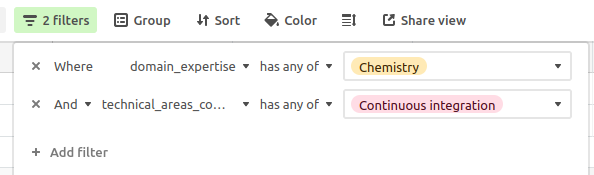

---
aliases:
  - editorguide.html
---

# Guía para el equipo editorial {#editorguide}

```{block, type="summaryblock"}
La revisión por pares de software en rOpenSci está gestionada por un equipo editorial.
El rol de Líder Editorial (LE) va rotando.
La información sobre el estado actual del equipo editorial se presenta en nuestro [*Editorial Dashboard*](#eic-dashboard).

Este capítulo presenta las responsabilidades de [quién lidera el equipo editorial](#eicchecklist), y de [cualquiera a cargo de editar un envío](#editorchecklist).
También describe [cómo responder a un envío fuera del alcance de rOpenSci](#outofscoperesponse) y proporciona orientación sobre [cómo responder a las preguntas de quién revisa paquetes](#reviewersupport).

Si estás en el rol de edición de forma invitada, ¡gracias por tu ayuda! Si tienes alguna duda, ponte en contacto con la persona que te invitó a encargarte del proceso de revisión de un paquete.

**La comunidad de rOpenSci es lo más importante. 
Nuestro objetivo es que las revisiones sean abiertas, no conflictivas y con el objetivo de mejorar la calidad del software. 
¡Sé amable! y comportate con respeto.
Consulta nuestra guía para quienes realizan una revisión y el [código de conducta] (https://ropensci.org/code-of-conduct/) para más información.**
```

Este capítulo está estructurado para reflejar la progresión típica de una revisión de software de rOpenSci.
Todos los envíos son considerados inicialmente por el rol de Líder Editorial (LE), que toma la decisión inicial sobre si un paquete está dentro del ámbito de aplicación.
En caso afirmativo, se asigna alguién del equipo editorial, que tiene la responsabilidad de guiar el proceso de revisión propiamente dicho.

## Responsabilidades del rol de LE {#eicchecklist}

Quien ocupa el rol de LE desempeña sus funciones durante 3 meses o durante el tiempo que acuerde el equipo editorial completo.
Quien ocupa el rol de LE es responsable de [la dirección general](#eic-general) del proceso de revisión y de la [fases iniciales](#eic-submission) de todos los envíos.

### Funciones generales del rol de LE {#eic-general}

Se encarga de la gestión general de todos los [_issues_ de revisión del software](https://github.com/ropensci/software-review/issues?q=sort%3Aupdated-desc%20is%3Aissue%20is%3Aopen) con la ayuda de nuestro [panel editorial](https://dashboard.ropensci.org), como se describe a continuación en la [subsección del panel de control](#eic-dashboard).
Las responsabilidades del rol de LE incluyen las siguientes tareas generales:

- Al comienzo de una rotación, debe revisar el estado de las revisiones abiertas actuales en el [dashboard editorial](https://dashboard.ropensci.org/reviews.html) y enviar recordatorios a editores/as o autores/as de paquetes según sea necesario.

- Vigila todos los *issues* publicados en el repositorio de revisión del software, para lo cual se suscribe a las notificaciones del repositorio en GitHub, y vigila el canal `#editors-only` en Slack.

- Supervisa regularmente (por ejemplo, semanalmente) el ritmo de todas las revisiones abiertas, echando un vistazo al [dashboard](https://dashboard.ropensci.org/reviews.html) y recordando a los demás integrantes del equipo editorial que hagan avanzar los paquetes según sea necesario.

### Tareas del rol de LE para cada envío inicial {#eic-submission}

Quien ocupa el rol de LE es responsable de tramitar inicialmente todos los nuevos envíos.
Sus funciones principales son

1. Decidir si un envío debe considerarse o no dentro del alcance de rOpenSci y proceder a su revisión, y en caso afirmativo,
2. Proceder a un envío completo y asignar a alguien del equipo editorial al envío.

#### Decidir el alcance y el solapamiento

Tiene derecho a tomar decisiones de alcance y de solapamiento con la mayor independencia posible (puede solicitar ayuda/asesoramiento), pero se le recomienda que solicite opiniones en el canal `#editors-only` en Slack.
Las decisiones sobre el alcance del software estadístico suelen ser más sencillas que las relativas a las propuestas generales (no estadísticas), tal y como se describe a continuación (#eic-stats-submissions).
Para cada nuevo _issue_ de consulta preenvío o envío, debe:

- Referirse a las categorías descritas en [*Objetivos y ámbito de aplicación*](#aims-and-scope) para tomar decisiones sobre el alcance y el solapamiento de las consultas preenvío, las recomendaciones de JOSS y de otras organizaciones con las que tenemos acuerdos de publicación, y los envíos.
  - Inicia debates en el canal `#editors-only` del Slack de rOpenSci, resumiendo los paquetes enviados o las consultas previas a los envíos, junto con cualquier preocupación que pueda tener.
  - Si considera que no ha recibido suficientes respuestas al cabo de uno o dos días, puede enviar un ping a todo el equipo editorial.
  - Debe buscar otras opiniones sobre los envíos que vayan más allá de sus propias áreas de experiencia.
  - El software estadístico debe considerarse dentro del ámbito de aplicación siempre que pueda cumplir al menos la mitad de las [normas aplicables (generales y al menos una categoría)](https://stats-devguide.ropensci.org/standards.html).

- Si se considera que una consulta de preenvío o un envío está fuera del alcance de publicación, debe agradecer a las personas que enviaron el paquete, explicarles los motivos de la decisión y, si procede, mencionarles otros medios de publicación.
  Cuando corresponda, usa el texto de [*Objetivos y alcance*](#aims-and-scope) sobre la evolución de los temas y el ámbito de aplicación a lo largo del tiempo.
  
  - [Ejemplos de envíos y respuestas fuera del ámbito de aplicación](https://github.com/ropensci/software-review/issues?q=is%3Aissue+is%3Aclosed+label%3Aout-of-scope).
  
  - Tras explicar una decisión fuera del ámbito de aplicación, escribe un comentario en el _issue_ `@ropensci-review-bot out-of-scope`.

- Si una consulta de preenvío se considera dentro del alcance, el LE *puede* realizar las comprobaciones preliminares.
  La [*plantilla de edición*](#editortemplate) puede utilizarse para ello.
  Para ayudar a quién envió el paquete a responder a los comentarios editoriales, es útil utilizar una notación inequívoca para cada comentario, como por ejemplo
  
  ```
  Mis comentarios estan etiquetados con "EL" y números. Por favor usa esta notación en tu respuesta."
  
  **EL01** Por favor, mejora el README
  ```
  
  También puede ayudar distinguir los requisitos de las recomendaciones, por ejemplo, formateando los requisitos como casillas de verificación (`- [ ] **EIC01**`).
  Por supuesto, puedes utilizar los prefijos que quieras, incluidas tus propias iniciales, como en [este ejemplo de Mauro Lepore del equipo editorial](https://github.com/ropensci/software-review/issues/673#issuecomment-2559753922).

Las decisiones sobre el alcance pueden requerir más información por parte de quién envió el paquete.
Quien ocupa el rol de LE debe asegurarse mínimamente de que la documentación es suficiente para juzgar el alcance, incluido un sitio web adjunto.
En ese caso, por favor, pide más detalles: aunque el paquete se considere fuera de alcance, la documentación del paquete habrá mejorado, así que no nos molesta pedir estos esfuerzos.
Ejemplo de texto:

```markdown
Hola <nombre> y muchas gracias por su envío.

Estamos discutiendo si el paquete está dentro de nuestro alcance temático y necesitamos un poco más de información.

¿Te importaría añadir más detalles y contexto al *README*?
Después de leerlo alguien con poco conocimiento del dominio debería tener suficiente información sobre el objetivo, las metas y la funcionalidad del paquete.

<opcional>
Si un paquete tiene funcionalidad que se solapa con otros paquetes, requerimos que demuestre en la documentación [por qué es único en comparacion con otros paquetes similares](https://devguide.ropensci.org/policies.html#overlap). 
¿Podrías añadir una comparación más detallada con los paquetes que mencionas en el *README* para que podamos evaluarlo?
</opcional>
```

#### Tareas iniciales de rol de LE para envíos completos

- Una vez confirmado que un paquete puede pasar a un envío completo, se invita a realizarlo y, a continuación, se cierra el _issue_ con la consulta preenvío.

- Etiqueta inicialmente cada nuevo envío completo con ` 0/editorial-team-prep`

- Encuentra alguién del equipo editorial para que se encargue del envío (incluido tú, potencialmente).
  Quiénes están disponibles actualmente se indican en la página [*Panel Editorial*](https://dashboard.ropensci.org), y las cargas de trabajo editoriales deben distribuirse de la forma más uniforme posible, remitiéndose al [*Cuadro de envíos*, gráficos de carga editorial reciente](https://dashboard.ropensci.org/editors.html#past-ed-load).
  También se puede designar a una persona editora invitada para encargarse de cualquier envío, tal como se describe en la [subsección siguiente](#guesteditor).

- Asigna a una persona para la edición con un comentario de:
  
  ```
  @ropensci-review-bot assign @username as editor
  ```
  
  Esto también añadirá la etiqueta `1/editor-checks` al issue.

#### Envíos de software estadístico {#eic-stats-submissions}

El software estadístico debe considerarse dentro del ámbito de aplicación siempre que cumpla con > 50% de todas las [normas aplicables](https://stats-devguide.ropensci.org/standards.html).
Si una consulta previa a la presentación indica que ya se han cumplido las normas, quien ocupa el rol de LE debe:

- Usar `@ropensci-review-bot check srr` para confirmar que se han cumplido las normas.
- Considerar si el paquete está mejor situado en la categoría estadística designada o si podrían ser adecuadas categorías alternativas o adicionales.

Si aún no se han cumplido las normas, pedir a quien envió el paquete que juzgue si cree que su paquete podrá cumplir al menos la mitad de las normas generales y específicas de la categoría.
Esto puede requerir un debate sobre la categoría o categorías adecuadas.
Si las personas autoras no han cumplido las normas, pero están de acuerdo en hacerlo, por lo general, debe aplicarse una etiqueta de _"holding"_ hasta que `@ropensci-review-bot check srr` dé el visto bueno (✅).
Los detalles completos para el tratamiento por parte del rol de LE de los envíos de software estadístico se facilitan en el correspondiente [*capítulo de la Guía de desarrollo de paquetes estadísticos*](https://stats-devguide.ropensci.org/pkgsubmission.html#editor-in-chief).

### El tablero editorial de rOpenSci {#eic-dashboard}

El [*tablero editorial de rOpenSci*](https://dashboard.ropensci.org) se actualiza a diario, principalmente mediante la extracción de información de todos los _issues_ de software en GitHub, junto con información adicional de Slack y de nuestra base de datos en Airtable.
El panel proporciona una visión general actualizada de nuestro equipo editorial, de sus responsabilidades recientes y del estado actual de todos los _issues_ de revisión de software.
Quien ocupa el rol de LE (o cualquier persona que esté interesada) puede obtener una visión general del estado del equipo editorial, su disponibilidad y las cargas de trabajo recientes en la [página sobre *equipo editorial*](https://dashboard.ropensci.org/editors.html).
Debe utilizarse para encontrar y asignar editores/as para los nuevos temas de revisión de software.
En la [página *Revisión de software*](https://dashboard.ropensci.org/reviews.html) se ofrece una visión general de todas las revisiones de software actuales, con entradas clasificadas por "urgencia", que se resumen en la [tabla al final de dicha página](https://dashboard.ropensci.org/reviews.html#urgency-of-reviews).

Las tareas para las revisiones en las fases de revisión específicas incluyen:

- Revisar los envíos en `0/editorial-team-prep` y `1\/editorial-team-prep`, para comprobar si hay que tomar alguna medida (como sondear al equipo editorial, tomar decisiones, dejar _issues_ en espera, hacer ping para actualizaciones, o buscar y asignar personas editoras).

- Revisa los envíos en `2\/seeking-reviewer(s)` para asegurarte de que todo avanza con rapidez.
  Si la búsqueda de personas que revisen se prolonga por un tiempo inusualmente largo (en color rojo), comprueba si el envío está en espera, lee el hilo para reunir contexto y ponte en contacto con la persona encargada en privado para pedirle más información.

- Revisa los envíos en `3\/reviewer(s)-assigned`.
  Si siguen faltando revisiones después de un tiempo inusualmente largo (color rojo), comprueba si el envío está en espera, lee el hilo para recopilar el contexto y ponte en contacto con la persona editora responsable en privado para pedirle más información.

- Revisa los envíos en `4\/review(s)-in-awaiting-changes`.
  Si algunos siguen sin respuesta de las personas autoras después de un tiempo inusualmente largo (en color rojo), comprueba si el envío está en espera, lee el hilo y ponte en contacto con la persona encargada en privado para pedir más información.

### Invitar a una persona para la tarea de edición  {#guesteditor}

Tras debatirlo con el resto del equipo, quien sea LE puede invitar a una persona externa para que se encargue de un envío.
Las invitaciones a colaborar en la edición pueden ser deseables o necesarias si el volumen de envíos es grande, si todo el equipo editorial tiene un conflicto de intereses, si se requieren conocimientos específicos o como prueba antes de enviar una invitación a formar parte del equipo editorial.

Para decidir a quién invitar para un envío:

- Crea un canal privado de Slack llamado #editor-invitado<nombre-paquete>.
- Invita al equipo editorial a ese canal.
- Busca en canales de Slack similares, archivados, posibles recomendaciones.
- Cuando se haya tomado una decisión y una persona invitada haya aceptado, archiva el canal.

En caso de recurrir a colaboración editorial externa:

- Pregunta sobre los conflictos de intereses utilizando el [mismo texto que para quienes revisan paquetes](#coi),
- Proporciona un enlace a la [guía para quines se encargan de la edición](#editorchecklist).

Si la persona acepta (¡bien!),

- asegúrate de que [haya activado la autenticación de 2 factores en su cuenta de GitHub](https://help.github.com/articles/securing-your-account-with-two-factor-authentication-2fa/);
- invítala al equipo `ropensci/editors` y a la organización ropensci;
- una vez que haya aceptado esta invitación al repositorio, asígnale el *issue*;
- asegúrate de que la persona ya se encuentra en el espacio de trabajo en Slack de rOpenSci;
- Pide a una persona del *staff* de rOpenSci que agregue su nombre a la tabla `guest-editors` en Airtable (para que los nombres aparezcan en este libro y en el README de la revisión del software).

Una vez finalizado el proceso de revisión (paquete aprobado, issue cerrado),

- vuelve a dar las gracias a la persona invitada;
- elimínala del equipo `ropensci/editors` (pero no de la organización ropensci).

## Responsabilidades del rol de edición {#editors-responsibilities}

- Además de ocuparse de los paquetes (unos 4 al año), quienes realizan la edición intervienen en las decisiones editoriales del equipo (como si un paquete está dentro del ámbito de aplicación) y determinan las actualizaciones de nuestras políticas.
  Generalmente lo hacemos a través de Slack, que esperamos que los miembros del equipo puedan consultar con regularidad.

- No tienes que hacer un seguimiento de otros envíos, pero si observas un problema con un paquete que está siendo gestionado por otra persona, no dudes en plantear ese problema directamente a quien está a cargo de la edición, o publica la preocupación en el canal exclusivo para el equipo editorial en Slack.
  Por ejemplo:
  
  - Sabes de un paquete que se solapa, que aún no se ha mencionado en el proceso.
  - Ves una pregunta para la que tienes una respuesta experta que no se ha dado al cabo de unos días (por ejemplo, sabes de un artículo en el blog que aborda cómo añadir imágenes a los documentos del paquete).

## Lista de tareas para la edición de un paquete  {#editorchecklist}

Las personas asignadas como editoras son responsables de guiar cada envío asignado a lo largo de todo el proceso, desde la presentación inicial hasta la aceptación final.
A cada persona del equipo editorial no se les debe asignar más de un _issue_ por trimestre, o un máximo de cuatro al año.

### En el momento del envío: {#upon-submission}

#### Comprobaciones automáticas

- El envío generará automáticamente una salida de comprobación de paquetes del robot de revisión ropensci.
  Todos los fallos de comprobación (❌) deben rectificarse antes de continuar, aunque pueden justificarse excepciones a discreción de quién realiza la edición.
  Anima a quién envió el paquete a activar las comprobaciones llamando a `@ropensci-review-bot check package` para confirmar que todas las comprobaciones son correctas (✅).
- Examina todos los elementos marcados con 👀, y solicita más información o medidas a las personas autoras del paquete cuando corresponda.
- Para los envíos estadísticos (identificables como "Tipo de envío: Estadísticas" en la plantilla de edición), añade la etiqueta `stats` a la edición (si no se ha añadido ya).
  - Si quién envió el paquete ha identificado que ha "incorporado la documentación de las normas ... a través del [srr](https://docs.ropensci.org/srr) entonces llama a `@ropensci-review-bot check srr` para confirmar que se han cumplido al menos el 50% de todas las normas.
- Comprueba que la plantilla de _issues_ se ha rellenado correctamente. Los descuidos y omisiones más comunes deberían ser detectados y anotados por el robot, pero una comprobación manual siempre ayuda.
  Las personas editoras pueden editar las plantillas directamente para realizar correcciones menores, o bien indicar a los autores y autoras que rellenen los campos obligatorios de la plantilla que puedan faltar.
- El sistema de comprobación se reconstruye cada martes a las 00:01 UTC (una accion de GitHub que se ejecuta semanalmente los martes a la madrugada), y puede tardar un par de horas.
  Si las comprobaciones automáticas fallan a esa hora, espera unas horas y vuelve a intentarlo.

Las comprobaciones automáticas también incluyen un *Statistical properties* (*Propiedades estadísticas*) con un desplegable con información detallada.
La sección desplegable señala todas las propiedades "notables", definidas como aspectos que se encuentran en el percentil quinto superior o inferior en comparación con los valores de todos los paquetes CRAN actuales.
Presta especial atención a:

- Valores extremadamente grandes o pequeños de líneas de código ("loc").
- Valores extremadamente grandes o pequeños para el número de funciones ("n\_fns\_...").

El informe automatizado también incluirá un enlace a una *visualización interactiva en red de las llamadas entre objetos del paquete*.
Esta visualización puede ofrecer una perspectiva útil sobre cómo están estructuradas las funciones dentro de un paquete.
Utiliza toda esta información para juzgar si:

- Un paquete tiene muy pocas funciones o líneas de código, en cuyo caso puede estar insuficientemente desarrollado para la revisión por pares.
- Un paquete es extremadamente grande, por lo que puede resultar demasiado pesado para quienes revisan.
  Por ejemplo, [estas consultas iniciales](https://github.com/ropensci/software-review/issues/725#issuecomment-3326436119) revelaron un paquete con más de 8.500 líneas de código en R (correspondientes al 97,6% de todos los paquetes) y 251 funciones R exportadas.

#### Comentarios editoriales iniciales

- Después de contabilizar las comprobaciones automáticas, utiliza la [plantilla editorial](#editortemplate) para guiar las comprobaciones iniciales (si no están ya cubiertas por quien ocupa el rol de LE) y registrar tu respuesta al envío.
  También puedes agilizar las comprobaciones editoriales utilizando la plantilla del paquete [`pkgreviewr`, creado por Anna Krystalli cuando formaba parte del equipo editorial](https://docs.ropensci.org/pkgreviewr/articles/editors.html).
  Procura terminar las comprobaciones y empezar a buscar las personas para revisar en un plazo de 5 días laborables.
- Comprueba las políticas [de alcance](#aims-and-scope) y [solapamiento](#overlap). Inicia un debate en el canal de Slack #software-review sobre si es necesario, en casos especiales no detectados por comprobaciones previas, que se realice una revisión. Si se rechaza el paquete, consulta [esta sección](#outofscoperesponse) para conocer cómo responder.
  Inicia el debate a través del canal de Slack #software-review si es necesario para casos extremos que no hayan sido detectados en comprobaciones previas de LE.
  Si se rechaza, consulta [esta sección](#outofscoperesponse) sobre cómo responder.
- Asegúrate de que el paquete se prueba en varias plataformas (haciendo que el paquete se construya en varios sistemas operativos a través de GitHub Actions, por ejemplo; véase [criterios en esta sección del capítulo CI](#whichci) para más detalles y opciones).
- Siempre que sea posible, cuando pidas cambios, sugiere herramientas automáticas como [usethis](https://usethis.r-lib.org/), [Air](https://posit-dev.github.io/air/), [Jarl](https://jarl.etiennebacher.com/), [flirtea](https://flir.etiennebacher.com/), y recursos en línea (secciones de esta guía, secciones del [Libro *R Packages*](https://r-pkgs.org/)) para facilitar tu devolución.
  [Ejemplo de comprobaciones de una editora](https://github.com/ropensci/software-review/issues/207#issuecomment-379909739).
- Lo ideal es que las observaciones que hagas se aborden antes de que las personas a cargo de la revisión comiencen su trabajo.
- Si los chequeos iniciales muestran falencias importantes, solicita cambios antes de asignar personas para la revisión.
  Si quien envió el paquete menciona que los cambios pueden llevar tiempo, [usa la etiqueta de espera escribiendo `@ropensci-review-bot put on hold`](#policiesreviewprocess).
  Recibirás un recordatorio cada 90 días (en el *issue*) para que te pongas en contacto con las personas a cargo del paquete.
- Si el paquete plantea un problema inesperado relacionado con la política de rOpenSci, inicia una conversación en Slack.

### Busca y asigna dos personas para revisar el paquete {#look-for-and-assign-two-reviewers}

#### Encontrar revisores {#finding-reviewers}

- Comenta con `@ropensci-review-bot seeking reviewers`.
- Utiliza la [plantilla de correo electrónico](#reviewrequesttemplate) si es necesario para invitar a las personas a participar en la revisión
  - Cuando envíes la invitación, incluye algo como "si no tengo noticias tuyas en una semana, asumiré que no puedes revisar", para dar un plazo claro en el que empezarás a buscar a alguien más.
  - Puedes enviar varias invitaciones al mismo tiempo, sobre todo porque esto suele ayudar a encontrar revisores más rápidamente.
    Siempre puedes responder diciendo que ya se ha encontrado a alguién para hacer la revisión, y dar las gracias a la gente por ofrecerse a pesar de todo.

Algunas fuentes de información para encontrar revisores son:

- las posibles sugerencias realizadas por quienes presentaron el paquete (aunque éstas pueden tener una visión limitada de los tipos de conocimientos necesarios; sugerimos no utilizar más de una de las personas sugeridas);
- la base de datos *Airtable* de revisión y voluntariado (ver siguiente subsección);
- y personas con [paquetes de rOpenSci](https://ropensci.org/packages/).

Cuando estas fuentes de información no sean suficientes,

- pide ideas al equipo editorial en Slack,
- busca personas que usen el paquete o de la fuente de datos o servicio al que se conecta el paquete (a través de la apertura de *issues* en el repositorio, destacándolo, citándolo en artículos, hablando de él en redes sociales).
- También puedes buscar personas con paquetes relacionados en [r-universe.dev](https://r-universe.dev/).
- R-Ladies tiene un [directorio](https://rladies.org/directory/) en el que se especifican las aptitudes e intereses de las personas incluidas en la lista.
- Puedes publicar la búsqueda en los canales #general y/o #software-review del Slack de rOpenSci, o en las redes sociales.

##### Consejos para la búsqueda en Airtable {#tips-for-reviewer-search-in-airtable}

Nuestra base de datos de Airtable aparece enlazada en la parte superior de nuestro canal de Slack «solo para editores».
Una vez que inicies sesión en Airtable a través de ese enlace, deberías ver «*Base de datos de reseñas de software de rOpenSci*» con la opción «*Buscar revisores*» en la parte superior izquierda:



Comprueba la revisión más reciente de la persona y evita a cualquiera que haya revisado en los últimos seis meses.
Asimismo, comprueba si una persona que es nueva revisando ha indicado que requiere tutoría en el campo`require_mentorship`.
En caso afirmativo, utiliza la parte de tutoría de la plantilla de correo electrónico y prepárate para proporcionar orientación adicional.

##### Criterios para elegir a las personas que harán la revisión {#criteria-for-choosing-a-reviewer}

Estos son los criterios que debes tener en cuenta a la hora de elegir a alguien para realizar la revisión. 
Puede que tengas que reunir esta información buscando en [*r-universe*](https://r-universe.dev) y en la página de GitHub del posible revisor, así como en su presencia general en Internet (sitio web personal, redes sociales).

- No ha revisado ningún paquete para rOpenSci en los últimos 6 meses.
- Alguna experiencia en el desarrollo de paquetes.
- Alguna experiencia de dominio en el campo del paquete o fuente de datos.
- No hay [conflictos de intereses](#coi).
- Intenta equilibrar lo que sabes sobre su experiencia con la complejidad del paquete.
- Diversidad: las dos personas que revisen el paquete no deberían ser hombres cis blancos.
- Alguna prueba de que que le interesa el software libre o las actividades de la comunidad de R, aunque enviar un correo electrónico sin esta información está bien.

Cada envío debe ser revisado por *dos* personas.
Aunque está bien que una de ellas tenga menos experiencia en el desarrollo de paquetes y más conocimientos del dominio, la revisión no debe dividirse en dos.
Ambas personas deben revisar el paquete de forma exhaustiva, aunque desde sus respectivas perspectivas.
En general, al menos una debe tener experiencia previa en revisiones y, por supuesto, invitar gente nueva amplía nuestro grupo de revisión.

#### Asignar revisores {#assign-reviewers}

- Para asignar a alguien para la revisión, usa `@ropensci-review-bot assign @username as reviewer`.
  Debe emitirse una orden para cada persona revisora.
  Si es necesario sacar a alguien de la revisión, usa `@ropensci-review-bot remove @username from reviewers`.
- Las fechas de vencimiento de las revisiones se fijan por defecto en [21 días](https://github.com/ropensci-org/buffy/blob/20c5ac630ce436a9cd7b698d217a0f680f368aa0/app/responders/ropensci/reviewers_due_date_responder.rb#L162-L164) (3 semanas) después de la fecha de asignación.
- Si quieres cambiar la fecha de vencimiento de una revisión utiliza `@ropensci-review-bot set due date for @username to YYYY-MM-DD`.

### Durante la revisión {#during-review}

- Consulta de vez en cuando a tanto a quienes están revisando el paquete como a quienes lo enviaron. Ofrece aclaraciones y ayuda cuando sea necesario.
- En general, espera 3 semanas para la revisión, 2 semanas para cambios posteriores, y 1 semana para la aprobación de los cambios por parte de quien hace la revisión.
- Una vez enviada cada revisión,
  - Escribe un comentario de agradecimiento a las personas que revisaron con tus propias palabras.
  - Registra la reseña escribiendo un nuevo comentario `@ropensci-review-bot submit review <review-url> time <time in hours>` como en [este ejemplo](https://github.com/ropensci/software-review/issues/705#issuecomment-2984012477).
- Una vez realizados los cambios, cambia la etiqueta de estado de revisión a `5/awaiting-reviewer-response` y pide a las personas a cargo de la revisión que indiquen su aprobación con la [plantilla de aprobación de revisión]{#approval2template}.
- Si quien presentó el paquete tiene la intención de presentar un [artículo científico](https://besjournals.onlinelibrary.wiley.com/hub/journal/2041210X/features/applicationpapers) en [*Methods in Ecology and Evolution*](https://besjournals.onlinelibrary.wiley.com/journal/2041210X), indícale que pueden presentarlo una vez finalizada la revisión. 

#### Responder a las preguntas del equipo de revisión {#reviewersupport}

Todas las personas que participan pueden pedir opiniones sobre aspectos del proceso de revisión, como, por ejemplo, el tono o el contenido de las revisiones o de las respuestas de los autores y autoras.
Aunque esta guía se esfuerza por ofrecer orientación suficiente para la mayoría de los casos, el equipo editorial está siempre disponible para cualquier pregunta.
Si observas algo que pueda editarse o añadirse productivamente a esta *Guía de desarrollo* abre una *issue* o *PR*.
Aparte de estos principios generales, estas revisiones proporcionan ejemplos útiles:

- Ejemplo duro pero constructivo: la parte de esta revisión que sugiere una reescritura de la viñeta: [ropensci/software-review#191 (comentario)](https://github.com/ropensci/software-review/issues/191#issuecomment-368254623).
- [El paquete `slopes`](https://github.com/ropensci/software-review/issues/420) que acabó siendo rediseñado fundamentalmente en respuesta a las revisiones. 
  Todas las revisiones fueron en todo momento totalmente constructivas, lo que parece haber desempeñado un papel importante a la hora de motivar a quienes desarrollaron el paquete a embarcarse en una revisión tan importante. 
  Comentarios como, *"este paquete no..."* o *"no tiene ..."* iban seguidas invariablemente de sugerencias constructivas sobre lo que se podría hacer (hay, por ejemplo, [varias en una de las primeras revisiones](https://github.com/ropensci/software-review/issues/420#issuecomment-858231647)).
- La revisión al paquete `tic` expresaban educadamente sus reservas: [https://github.com/ropensci/software-review/issues/305#issuecomment-504762517](https://github.com/ropensci/software-review/issues/305#issuecomment-504762517) y [https://github.com/ropensci/software-review/issues/305#issuecomment-508271766](https://github.com/ropensci/software-review/issues/305#issuecomment-508271766)
- El paquete `bowerbird` recibió una útil ["revisión previa"](https://github.com/ropensci/software-review/issues/139#issuecomment-322713737) que dio lugar a una división del paquete antes de las revisiones propiamente dichas.

Otros retos que pueden surgir durante la revisión son

- **Si quien presentó el paquete deja de responder**, consulta [las políticas](#policies) y/o notifica al resto del equipo editorial en el canal de Slack para discutirlo. 
  Es importante que, si se asignó a una persona para revisar un *issue* que se cerró, te contactes con esa persona al cerrarlo para explicarle la decisión y agradecerle una vez más su trabajo.
  Informa al equipo editorial en el canal de Slack para que, la próxima vez, se le asigne un envío con altas probabilidades de que la revisión se realice sin problemas.
- **Si alguien se retrasa en la revisión o deja de responder**, envía un recordatorio al cabo de 1 semana y de nuevo al cabo de 2 semanas.
  El primer recordatorio puede ser un `@tag` en GitHub.
  Después utiliza el correo electrónico u otro tipo de comunicación directa.
  Si al cabo de 3 semanas sigue sin haber respuesta, determina cuál es la mejor manera de seguir adelante sin esa personas:
  - Si una persona ya ha enviado su revisión principal y la otra persona revisora está activa y proporcionando comentarios sustanciales, el/la editor/a puede seguir adelante con el proceso de revisión y debe asumir la tarea de revisión complementaria para determinar si los cambios realizados por los y las autoras son suficientes.
  - Si la persona revisora ausente no ha enviado su revisión, la persona responsable de la edición debe intentar encontrar a una nueva persona para realizarla y proceder con el proceso de revisión una vez que haya dos revisiones.
    En este punto, se debe dar prioridad a la búsqueda de personas experimentadas que puedan comprometerse con una entrega rápida.
    Asegúrate de hacer ping al equipo editorial en Slack.
    - A su discreción, quien edita *puede* actuar como segunda persona revisora, pero solo tras múltiples intentos fallidos de encontrar una nueva persona revisora y si cuenta con experiencia suficiente.
      Desaconsejamos hacer esto con cierta frecuencia ya que aumenta la carga de trabajo y reduce la diversidad de puntos de vista aportados a la comunidad por quienes revisan.
    - Haz un comentario agradeciendo a la persona revisora original en cualquier caso y elimínala con `@ropensci-review-bot remove @username from reviewers`.

### Después de la revisión {#after-review}

- Aprueba el paquete con `@ropensci-review-bot approve <package-name>`
- Consulta la [sección siguiente]{#non-transferred-packages} para saber cómo permitir que autores y autoras mantengan el paquete en su propia organización de GitHub si prefieren no transferirlo a rOpenSci.
- Nomina el paquete para que aparezca en un artículo del blog de rOpenSci o en una nota técnica si crees que puede ser de gran interés.
  Por favor, anota en el *issue* de revisión una o dos cosas destacables y etiqueta a `@ropensci/blog-editors` para su seguimiento.
- Si el paquete tiene un libro asociado (aunque sólo sea parcialmente), ponte en contacto con [alguien del equipo de rOpenSci](https://ropensci.org/about/#team) para que se ponga en contacto con quienes lo mantienen y hable sobre su transferencia a [la página `ropensci-books` de la organización de GitHub](https://github.com/orgs/ropensci-books).

#### Paquetes que permanecen en las organizaciones originales de GitHub {#non-transferred-packages}

Para aquellas personas que deseen mantener los repositorios de su paquete en sus organizaciones originales de GitHub, en lugar de transferirlos a github.com/ropensci, la persona editora debe:

- Pedir que hagan un pull request a la organización con el [archivo JSON](https://github.com/ropensci/roregistry/blob/gh-pages/info/not_transferred.json) que enumera todos los repositorios que no han sido transferidos. [Ejemplo de transferencia](https://github.com/ropensci/roregistry/commit/9568a77c2081f89d58406efcc9089ef83d09fe59).

- Pedir al paquete que sustituya el contenido del código de conducta actual del repositorio por el del [código de conducta por defecto de la organización rOpenSci en GitHub](https://github.com/ropensci/.github/blob/main/CODE_OF_CONDUCT.md).

#### Promoción de paquetes {#package-promotion}

- Dirige a quién envió el paquete a los capítulos de la guía sobre [versionado y publicación de paquetes](#releases), [promocionando tu paquete](#marketing) y [gestión de GitHub](#grooming).
